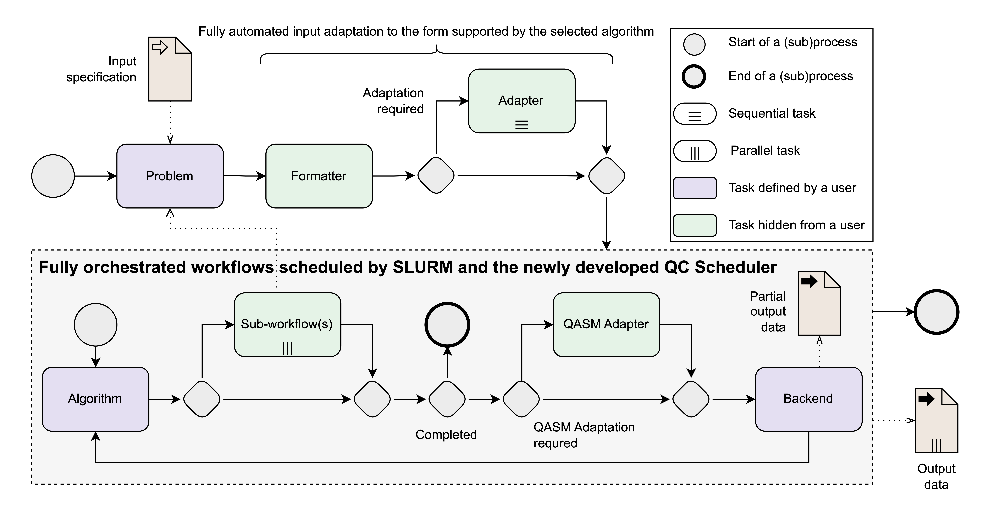

# Quantum Launcher

## About Project

Quantum Launcher is a high-level python library simplifying process of running quantum algorithms. Library aims to make it easier to run, test, benchmark and optimize your quantum algorithms, by providing bunch of tools, that can work in almost any configuration.

Library contains preset of problems and algorithms making it easier to benchmark one of them, without repeating the work multiple times (such as construction of problem's QUBO or Hamiltonian).

Quantum Launcher tries to split currently most common quantum algorithm pipeline, by splitting it into 3 parts: Problem, Algorithm and Backend, and provide some universal interface for running them.



## Supported features

Additionally to ability of quickly changing tested problem, algorithm or backend Quantum Launcher comes with bunch of useful features such as:

- Random problem instances generator.
- Automatic translation between problem formulations (e.g. QUBO -> Hamiltonian)
- QASM-based translation to match different frameworks (such as running qiskit's algorithm on cirq's computer).
- Asynchronous architecture to execute problems either standalone or in a grid.
- Access to more advances workflows with qcg-pilotjob.
- Interface for simple profiling of algorithms.
- Creation of more complex workflows using WorkflowManager enabling splitting algorithms across multiple devices.

## Installation

To install the following library use the following script:

```sh
pip install git+https://github.com/psnc-qcg/QCG-QuantumLauncher@QL-2.0
```

### Optional Installs

Quantum Launcher aims to work for many different architectures. Therefore in order to compatible with all of them Quantum Launcher be default installs only necessary requirements allowing user to decide what frameworks does one want to use. To make installation easier, there is a bunch of downloads that can be done with optional dependencies, for example:

```sh
pip install "git+https://github.com/psnc-qcg/QCG-QuantumLauncher@QL-2.0[qiskit]"
```

to install all requirements necessary to run qiskit algorithms.

## Supported backends

Quantum Launcher was made to simplify using of multiple different backends, therefore adding new backends is relatively easy.

For now supported backends are:

- Qiskit
- Orca Computing
- D-wave
- AQT
- Cirq

## Usage examples

Main idea of the project was to give a user quick and high level access to many different problems, algorithms and backends keeping interface simple.
For example to solve MaxCut problem with QAOA on qiskit simulator all you need to type is:

```py
# Necessary imports
from quantum_launcher import QuantumLauncher
from quantum_launcher.problems import MaxCut
from quantum_launcher.routines.qiskit_routines import QiskitBackend, QAOA

# Selecting problem, algorithm and backend
problem = MaxCut.from_preset('default')
algorithm = QAOA(p=3)
backend = QiskitBackend('local_simulator')

# Selecting launcher (Quantum Launcher by default, but other can be used for profiling/parallel processing)
launcher = QuantumLauncher(problem, algorithm, backend)

# Running the algorithm
result = launcher.run()
```

What the best in our library is that for changing only the algorithm for such as Quantum Annealing from Dwave, you don't actually need to specify that MaxCut will need to give Qubo, as it's done behind the user view.

```py
# Necessary imports
from quantum_launcher import QuantumLauncher
from quantum_launcher.problems import MaxCut
from quantum_launcher.routines.dwave_routines import SimulatedAnnealingBackend, DwaveSolver

# Selecting problem, algorithm and backend
problem = MaxCut.from_preset('default')
algorithm = DwaveSolver()
backend = SimulatedAnnealingBackend('local_simulator')

# Selecting launcher (Quantum Launcher by default, but other can be used for profiling/parallel processing)
launcher = QuantumLauncher(problem, algorithm, backend)

# Running the algorithm
result = launcher.run()
```

## License

This project uses the [To Be determined License](LICENSE).
